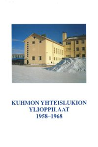
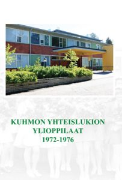

</img>

Kuhmon yhteislukion kannatusyhdistys perustettiin kesällä 2001 tarkoituksena tukea eri tavoin Kuhmon yhteislukion toimintaa.

Yhdistys ylläpitää yhteyksiä Kuhmon yhteislukion nykyisiin ja entisiin opettajiin ja opiskelijoihin, järjestää toimintansa tueksi erilaisia tapahtumia ja harjoittaa julkaisutoimintaa.

Yhdistys on julkaissut seuraavat ylioppilasmatrikkelit:

* Kuhmon yhteislukion ylioppilaat 1958-1968 (ei myynnissä)
* Kuhmon yhteislukion ylioppilaat 1969-1971 (15 €)
* Kuhmon yhteislukion ylioppilaat 1972-1976 (20 €)
* (edelliset yhdessä ostettuna yhteensä 30 €)
* Kuhmon yhteislukion ylioppilaat 1977-1980 (20 €)

</img>
</img>
</img>

Kannatusyhdistys jatkaa toimintaansa ja toivoo jäsenikseen lukion kasvatteja, jotka ovat halukkaita tukemaan lukion toimintaa muuttuvassa ympäristössä.

</img>

LIITY JÄSENEKSI JA TUE TOIMINTAAMME!

Jäsenmaksu vuosittain 15 euroa. Maksu suoritetaan tilille:

Tilille FI09 5177 0020 1355 76 

Saaja: Kuhmon yhteislukion kannatusyhdistys ry

Viestikenttään: Jäsenmaksu 2025

Lähetä  ilmoitus liittymisestä yhdistykseen, jäsenmaksun suorittamisesta tai kirjatilaus

sähköpostiin:  kykyhdistys@gmail.com 
